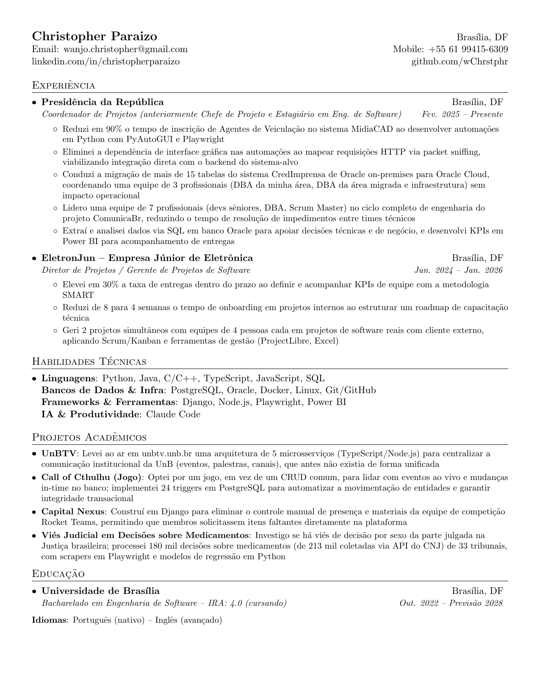

# Currículo — Christopher Paraizo

Currículo de uma página, mantido em LaTeX para manter a formatação consistente e evitar o trabalho manual de ajustar layout no Google Docs/Word a cada atualização. Baseado no template "Jake's Resume" criado por Sourabh Bajaj (MIT License).

**Christopher Paraizo** — Brasília, DF
[LinkedIn](https://linkedin.com/in/christopherparaizo/) · [GitHub](https://github.com/wChrstphr)

### Preview



### Estrutura

```
resumes/
  christopher_paraizo_resume.tex   # currículo, versionado no git
```

### Build usando Docker

```sh
docker build -t latex .
docker run --rm -i -v "$PWD":/data latex pdflatex -output-directory=resumes resumes/christopher_paraizo_resume.tex
```

Ou simplesmente:

```sh
./build.sh
```

O PDF também é recompilado automaticamente via GitHub Actions a cada push na `master`.

### License

Formato MIT, template original de Sourabh Bajaj. O conteúdo do currículo pertence a Christopher Paraizo.
